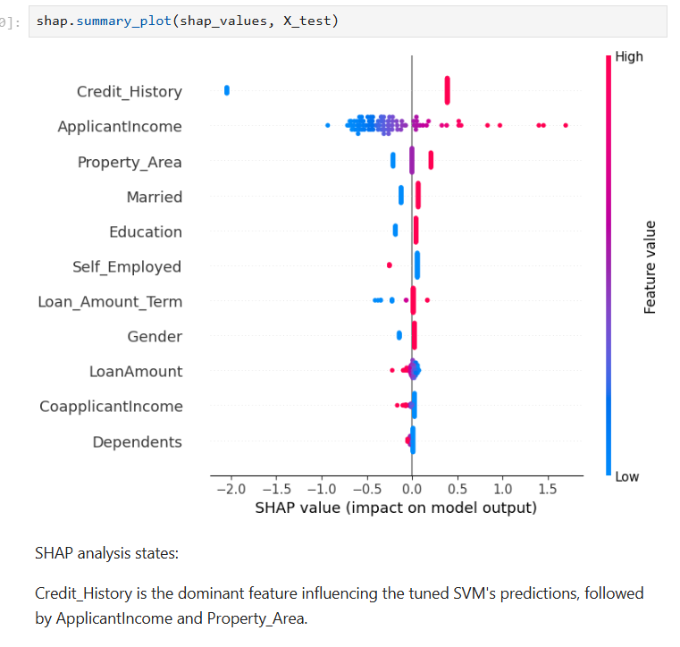
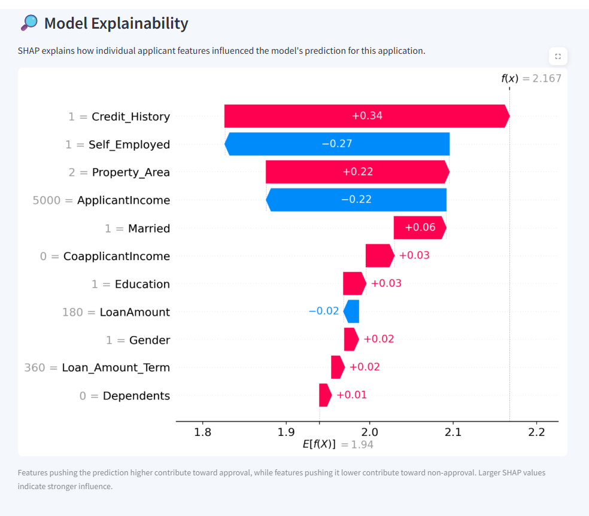
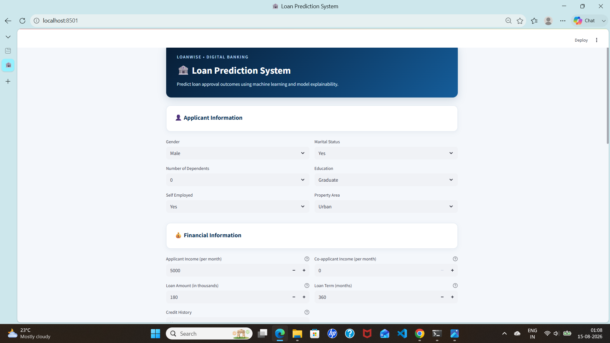
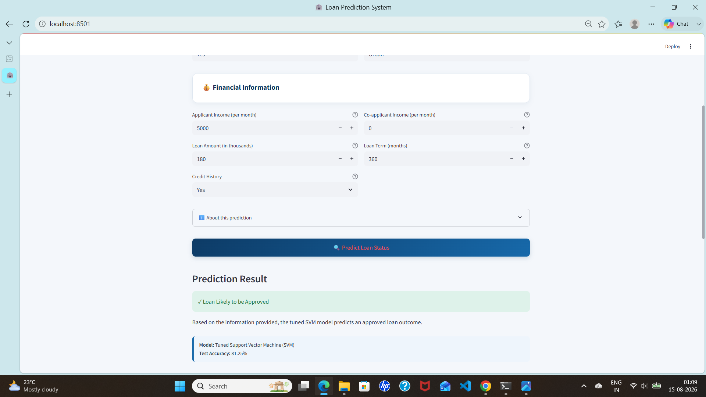

# 🏦 Loan Prediction System

### SVM + Hyperparameter Tuning + SHAP Explainability + Streamlit

An end-to-end machine learning project that predicts loan approval outcomes using classification models and explains individual predictions using SHAP.

The final tuned Support Vector Machine (SVM) model is integrated into an interactive Streamlit application for real-time loan prediction and model explainability.

---

## 📌 Project Overview

Loan approval decisions depend on multiple applicant and financial attributes such as income, credit history, loan amount, education, marital status, and property area.

The objective of this project is to build a machine learning classification system that:

- Predicts whether a loan application is likely to be approved or not
- Compares multiple classification algorithms
- Uses cross-validation and hyperparameter tuning to improve model selection
- Evaluates the final model using multiple performance metrics
- Uses SHAP to explain the model's predictions
- Deploys the final model through an interactive Streamlit application

---

## 🎯 Problem Statement

Build a binary classification model that predicts the loan approval status of an applicant based on demographic, financial, and credit-related features.

### Target Variable

`Loan_Status`

- `0` → Not Approved
- `1` → Approved

---

## 🔄 Project Workflow

~~~text
Dataset
   ↓
Data Cleaning
   ↓
Exploratory Data Analysis
   ↓
Categorical Encoding
   ↓
Train-Test Split
   ↓
Model Training
   ├── SVM
   ├── Random Forest
   └── XGBoost
   ↓
Model Comparison
   ↓
Cross-Validation
   ↓
SVM Hyperparameter Tuning
   ↓
Final SVM Evaluation
   ↓
SHAP Explainability
   ↓
Streamlit Deployment
   ↓
Loan Prediction + Model Explanation
~~~

---

## 📊 Dataset

The project uses a loan prediction dataset containing applicant demographic, financial, and credit-related information.

### Dataset Information

| Metric | Value |
|---|---:|
| Original Records | **614** |
| Records After Removing Missing Values | **480** |
| Training Records | **384** |
| Testing Records | **96** |

### Features

| Feature | Description |
|---|---|
| `Gender` | Applicant gender |
| `Married` | Marital status |
| `Dependents` | Number of dependents |
| `Education` | Education level |
| `Self_Employed` | Self-employment status |
| `ApplicantIncome` | Applicant income |
| `CoapplicantIncome` | Co-applicant income |
| `LoanAmount` | Requested loan amount |
| `Loan_Amount_Term` | Loan repayment term |
| `Credit_History` | Credit history indicator |
| `Property_Area` | Rural, Semiurban, or Urban |

---

## 🧹 Data Preprocessing

The following preprocessing steps were performed before model training.

### 1. Missing Value Handling

Rows containing missing values were removed from the dataset.

This reduced the dataset from **614 records to 480 records**.

### 2. Target Encoding

The target variable `Loan_Status` was converted into numerical values:

| Original Value | Encoded Value |
|---|---:|
| `N` | `0` |
| `Y` | `1` |

### 3. Categorical Encoding

Categorical variables were converted into numerical representations suitable for machine learning.

| Feature | Encoding |
|---|---|
| `Gender` | Male → 1, Female → 0 |
| `Married` | Yes → 1, No → 0 |
| `Education` | Graduate → 1, Not Graduate → 0 |
| `Self_Employed` | Yes → 1, No → 0 |
| `Property_Area` | Rural → 0, Semiurban → 1, Urban → 2 |
| `Dependents` | `3+` → 4 |

### 4. Feature and Target Separation

`Loan_ID` and `Loan_Status` were removed from the feature matrix.

The remaining applicant and financial features were used as model inputs, while `Loan_Status` was used as the target variable.

---

## 🤖 Models Compared

Three classification algorithms were initially evaluated:

- **Support Vector Machine (SVM)**
- **Random Forest**
- **XGBoost**

### Model Comparison

| Model | Training Accuracy | Testing Accuracy |
|---|---:|---:|
| **SVM** | 77.86% | **81.25%** |
| Random Forest | 100.00% | 79.17% |
| XGBoost | 100.00% | 80.21% |

SVM achieved the highest testing accuracy among the three models and was therefore selected for further cross-validation and hyperparameter tuning.

---

## 🔁 Cross-Validation

After the initial model comparison, **3-fold cross-validation** was performed on the SVM model.

The initial mean cross-validation accuracy was:

### **72.66%**

Cross-validation was used to evaluate the model across multiple training-validation splits rather than relying only on a single train-test split.

---

## ⚙️ Hyperparameter Tuning

`GridSearchCV` was used to identify the best hyperparameters for the SVM model.

### Parameter Search

| Parameter | Values Tested |
|---|---|
| `C` | 0.01, 0.1, 1, 10, 100 |
| `gamma` | scale, auto |
| `kernel` | linear, rbf |

### Best Parameters

| Parameter | Selected Value |
|---|---|
| `C` | **0.1** |
| `gamma` | **scale** |
| `kernel` | **linear** |

### Best Cross-Validation Accuracy

**78.13%**

The tuned SVM was then evaluated on the unseen test dataset.

---

## 📈 Final Model Performance

The tuned SVM achieved the following results on the test dataset:

| Metric | Score |
|---|---:|
| **Accuracy** | **81.25%** |
| **Precision** | **80.77%** |
| **Recall** | **95.45%** |
| **F1 Score** | **87.50%** |

The final model was also evaluated using a confusion matrix to examine correct and incorrect predictions for approved and non-approved applications.

---

## 🔎 SHAP Model Explainability

To make the machine learning model more interpretable, **SHAP (SHapley Additive exPlanations)** was used.

SHAP helps explain how individual features influence the model's predictions.

### 🌎 Global Feature Importance

The SHAP analysis identified the following as the most influential features:

1. **Credit_History**
2. **ApplicantIncome**
3. **Property_Area**

The SHAP summary plot provides an overall view of feature importance and the direction of feature influence across predictions.

### 📸 SHAP Summary Plot

### 👤 Individual Prediction Explainability

The Streamlit application also generates a SHAP waterfall plot for an individual applicant.

This answers an important question:

> **Why did the model make this particular prediction?**

Positive SHAP contributions push the model output higher, while negative contributions push it lower. Larger SHAP values indicate stronger influence on the individual prediction.

### 📸 SHAP Individual Prediction

---

## 🖥️ Streamlit Application

The final tuned SVM model was saved using **Joblib** and integrated into an interactive Streamlit application.

The application allows users to enter:

- Applicant information
- Financial information
- Credit history
- Property area
- Loan details

The system then generates a loan prediction and provides an explanation of the model's decision using SHAP.

### 1. Loan Prediction

The application provides one of two outcomes:

> **✓ Loan Likely to be Approved**

or

> **✕ Loan Likely to be Not Approved**

### 2. Model Information

The application displays information about the final tuned SVM model, including its test accuracy.

### 3. SHAP Model Explainability

After generating a prediction, the application displays an individual SHAP explanation showing how the applicant's features contributed to the prediction.

### 📸 Streamlit Interface

### 📸 Prediction Result

---

## 🧠 Deployment Architecture

The deployed system follows this workflow:

~~~text
User
  ↓
Streamlit Interface
  ↓
Applicant Inputs
  ↓
Categorical Encoding
  ↓
Feature Arrangement
  ↓
Saved Tuned SVM Model
  ↓
Loan Prediction
  ↓
SHAP Explanation
  ↓
Prediction + Model Explanation
~~~

The trained model is stored as:

`loan_svm_model.pkl`

The SHAP background dataset is stored as:

`loan_shap_background.pkl`

---

## 📁 Project Structure

~~~text
loan-prediction-svm/
│
├── app.py
├── Loan_Prediction_System.ipynb
├── Loan Prediction Dataset.csv
├── loan_svm_model.pkl
├── loan_shap_background.pkl
├── .gitignore
├── README.md
│
└── images/
    ├── streamlit_interface.png
    ├── prediction_result.png
    ├── shap_summary_plot.png
    └── shap_waterfall.png
~~~

---

## 🛠️ Technologies Used

### Programming Language

- Python

### Data Processing

- Pandas
- NumPy

### Data Visualization

- Matplotlib
- Seaborn

### Machine Learning

- Scikit-learn
- Support Vector Machine (SVM)
- Random Forest
- XGBoost

### Model Selection

- Cross-Validation
- GridSearchCV

### Model Explainability

- SHAP

### Deployment

- Streamlit

### Model Serialization

- Joblib

---

## ▶️ How to Run the Project

### 1. Clone the Repository

~~~bash
git clone https://github.com/snehaseveriya23/loan-prediction-svm.git
~~~

### 2. Navigate to the Project Directory

~~~bash
cd loan-prediction-svm
~~~

### 3. Install Required Libraries

~~~bash
pip install pandas numpy matplotlib seaborn scikit-learn xgboost shap streamlit joblib
~~~

### 4. Run the Streamlit Application

~~~bash
streamlit run app.py
~~~

The application will open in your default web browser.

---

## 📌 Key Highlights

- Built an end-to-end **loan prediction system**
- Performed **data cleaning and preprocessing**
- Compared **SVM, Random Forest, and XGBoost**
- Evaluated models using **training and testing accuracy**
- Performed **3-fold cross-validation**
- Used **GridSearchCV for SVM hyperparameter tuning**
- Selected a tuned **linear SVM** as the final model
- Achieved **81.25% test accuracy**
- Achieved **95.45% recall**
- Used **SHAP for global model explainability**
- Implemented **individual SHAP explanations**
- Built an interactive **Streamlit application**
- Integrated the trained model into a user-facing prediction system

---

## 🚀 Future Improvements

The current system can be extended with:

- **What-if Analysis** for changing applicant attributes and observing prediction changes
- **Prediction probability / risk estimation**
- **Fairness and bias analysis**
- **REST API integration**
- **Model monitoring**
- **Automated model retraining**
- **Improved preprocessing pipeline**
- **Cloud deployment**
- **Database integration**
- **User authentication and application history**

---

## ⚠️ Disclaimer

This project is developed for **educational and demonstration purposes**.

The predictions generated by the model should not be considered guaranteed banking or financial decisions.

The system demonstrates how machine learning can be applied to loan prediction and model explainability.

---

## 👩‍💻 Author

### Sneha Severiya

**B.Tech Data Science Student**

🔗 **GitHub:**  
https://github.com/snehaseveriya23

---

## ⭐ Project Summary

This project demonstrates an end-to-end machine learning workflow, starting from data preprocessing and model comparison and progressing through cross-validation, hyperparameter tuning, model evaluation, SHAP explainability, and Streamlit deployment.

The final system combines **machine learning prediction with model explainability**, providing both a predicted loan outcome and an explanation of the features influencing that prediction.
